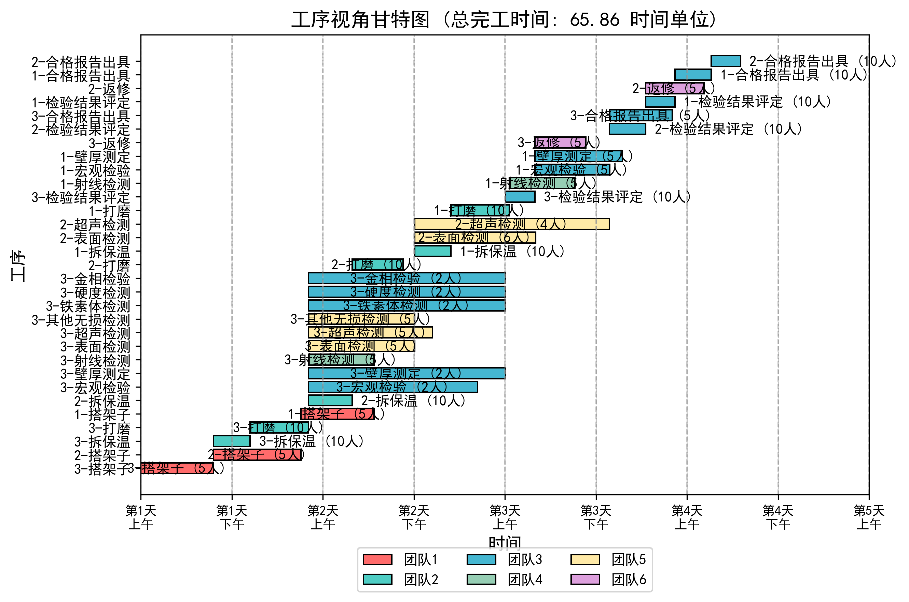
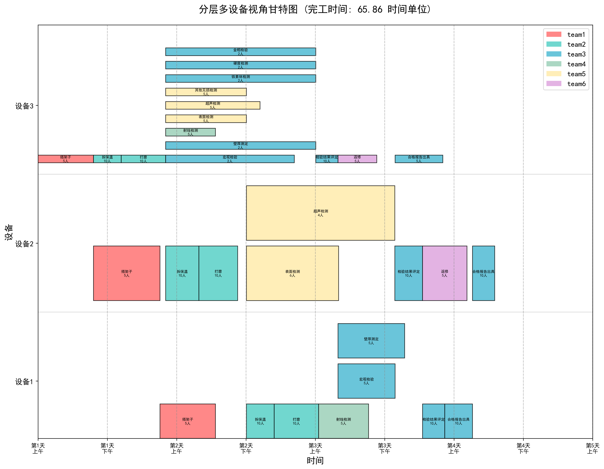
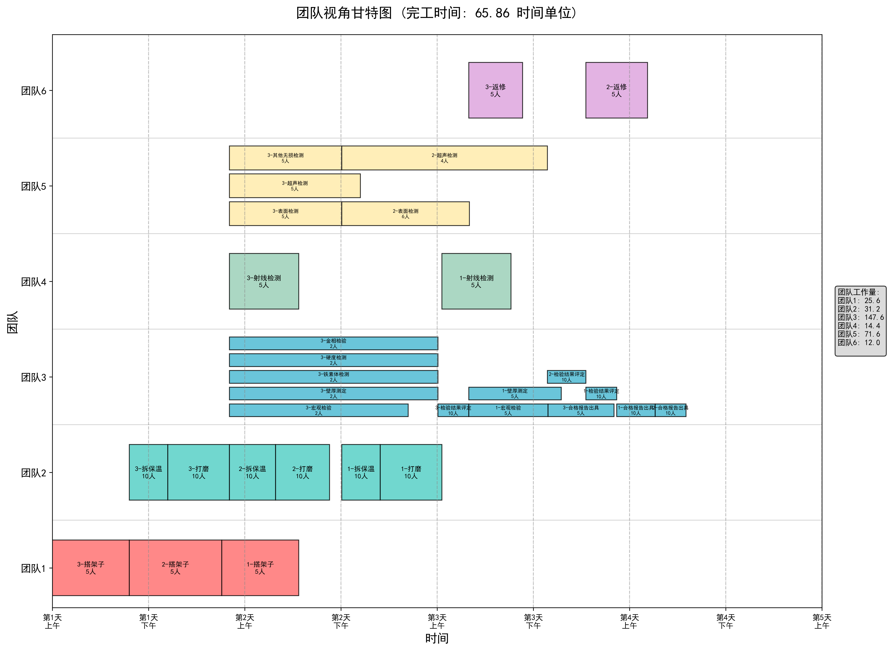

# 多设备人员调度优化模型

## 摘要

本研究针对典型石油管道检修场景的多设备人员调度问题，建立了一个考虑跨设备资源共享的优化模型。该模型在传统单设备调度模型的基础上，引入了设备维度，实现了多个设备并行作业时的团队人员动态分配。模型考虑了工序间的顺序约束、并行工序的协同、专用团队与共用团队的差异化管理，以及人员分配对工序时间的非线性影响。目标是在满足所有约束条件下，最小化所有设备的最大完工时间（makespan），从而提高石油管道检修场景整体生产效率。

## 1. 研究背景、现状及方法路线

### 1.1 研究背景

#### 1.1.1 石油化工管道检修的现实背景

石油化工管道作为国家能源运输的"生命线"，承担着原油、成品油、天然气等重要能源的长距离输送任务。根据国家发展改革委发布的《中长期油气管网规划》，至2025年末，中国油气管网总规模将达到24万公里，其中原油管道3.7万公里、成品油管道4万公里、天然气管道16.3万公里，形成了横跨东西、纵贯南北的能源动脉网络。这些管道在长期运行过程中，受到内部介质腐蚀、外部环境侵蚀、机械应力作用等多重因素影响，必须进行定期检修和维护，以确保管道系统的安全运行和长期可靠性。

**管道检修的现实挑战**：

随着管网规模的不断扩大和运行年限的延长，管道检修作业呈现出以下趋势：
- **检修规模大**：单次大修可能涉及数十公里管线、上百个焊口、多个关键设备
- **工期要求紧**：管道停输期间经济损失巨大（千万吨级企业每天损失可达数百万元），要求在有限时间内完成所有检修任务
- **技术要求高**：涉及焊接、无损检测、防腐等多个专业技术领域，对人员资质和作业质量要求严格
- **组织难度大**：需要协调多个专业团队、多种设备资源，在时间和空间上进行精细化调度

这些现实挑战使得管道检修的人员调度问题成为制约检修效率和成本的关键瓶颈。

#### 1.1.2 人员调度问题的理论框架

人员调度问题（Workforce Scheduling Problem，WSP）是智能制造系统中普遍存在的一类关键优化问题。其目标是在满足资源约束和任务工艺流程的前提下，合理安排人员参与任务执行，从而提高整体生产效率。随着制造业向柔性化、智能化方向发展，人员调度的复杂性急剧增加：一方面，工序流程复杂、任务量大；另一方面，不同工人的技能、疲劳程度、任务偏好等因素也显著影响调度效果。

传统的调度方法，如优先规则、线性规划和启发式算法，虽在特定场景中有效，但在面对多约束、动态变化和大规模任务的复杂系统时，往往存在计算效率低、泛化能力弱的问题。近年来，**深度强化学习（Deep Reinforcement Learning，DRL）**因具备从经验中学习策略、处理高维状态空间、适应复杂环境等优势，成为解决动态调度问题的有力工具。

在实际生产环境中，如柔性制造系统（Flexible Manufacturing System，FMS）和流程工业（如化工车间），人员调度不仅要考虑任务流程约束，还要兼顾人员技能差异、工人状态变化、工序并行性等多个因素。这对传统调度策略提出了挑战，也为智能调度技术提供了广阔的应用空间。

**从WSP理论到管道检修应用**：

石油化工管道检修本质上是一个典型的WSP应用场景，但相比传统的车间调度、项目管理等问题，呈现出独特的复杂性：

1. **多设备并行的复杂性**：不同于传统单设备调度，管道检修场景涉及多个设备同时作业，团队需要在设备间动态调度
2. **专业技能的异质性**：各类专业团队（焊接、检测、表面处理等）的技能、资质、作业模式差异显著
3. **工艺约束的刚性**：检修工序必须严格遵循阶段顺序（拆保温→表面处理→焊接→检验→恢复），约束强度高
4. **资源竞争的动态性**：有限的专业团队需要在多个设备间共享，存在时间依赖的资源冲突

#### 1.1.3 管道检修调度的具体挑战

管道检修场景具有以下典型特征，使其成为WSP研究中极具挑战性的应用领域：

1. **多设备并行作业需求**：在管道集中检修期（通常为停输期或计划性维护期），往往需要同时对多个管道段、多个焊口、多个设备进行检修作业。例如，某炼化企业在年度大检修期间，可能需要同时对3-5个主要管道设备进行维护，涉及拆保温、表面处理、焊接修复、无损检测、防腐处理等多个专业环节。

2. **专业团队资源稀缺**：管道检修需要多个专业技能团队协同作业，包括保温拆装团队、表面处理团队、焊接团队、射线检测团队、超声波检测团队等。这些团队往往是企业的核心技术力量，人员数量有限且培养周期长。以射线检测团队为例，操作人员需持有特种作业证书，培养周期长达2-3年，是典型的稀缺资源。

3. **工艺流程的刚性约束**：管道检修必须严格遵循工艺流程，各阶段工序存在强制性的前后依赖关系。例如，表面打磨必须在拆除保温层之后进行，焊接修复必须在表面清洁干燥之后进行，射线检测必须在焊接完成之后进行。这种刚性的工艺约束使得调度问题更加复杂。

4. **经济压力的紧迫性**：管道停输检修期间，往往伴随着巨大的经济损失。以某千万吨级炼化企业为例，主管道停输每天的经济损失可达数百万元。因此，如何在满足安全质量要求的前提下，最大限度缩短检修工期，成为企业管理的核心痛点。

5. **传统方法的局限性**：传统的管道检修调度主要依赖调度人员的经验，采用手工排程或简单的Excel表格工具。面对多设备、多团队、多工序的复杂场景，人工调度难以全局优化，容易出现资源冲突、团队等待、设备闲置等问题，导致工期延长、成本增加。

#### 1.1.4 传统调度方法的系统性不足

现有的管道检修调度方法主要存在以下局限性：

1. **单设备视角的片面性**：传统调度模型大多基于单设备或单管道段的局部优化，缺乏对多设备并行作业的全局考虑。这种"头痛医头、脚痛医脚"的调度方式，无法充分发挥多设备并行的效率优势，导致整体工期难以压缩。

2. **静态资源分配的僵化性**：传统方法通常在调度初期就固定分配团队与设备的对应关系（如"团队A负责设备1、团队B负责设备2"），缺乏动态调整机制。当某个设备的工序提前或延后完成时，无法灵活调配团队资源，造成资源闲置或等待。

3. **人员数量配置的经验性**：工序所需人员数量的确定往往基于经验估计或历史数据的简单平均，缺乏对人员规模与工序时间非线性关系的量化建模。这导致人员配置要么过剩（浪费人力资源），要么不足（延长工序时间），难以达到最优。

4. **约束处理的简化性**：传统方法难以精确处理多设备场景下的复杂约束，特别是跨设备团队容量约束、时间依赖约束等。调度方案往往存在隐性冲突（如同一团队在同一时刻被分配到多个设备），需要事后人工修正，增加了调度成本。

5. **优化目标的单一性**：大多数传统方法仅关注单个指标（如makespan或资源利用率），缺乏对多目标的综合权衡。例如，在追求最短工期的同时，可能导致部分团队过度负荷，影响作业质量和安全。

#### 1.1.5 深度强化学习在调度问题中的应用前景

随着人工智能、大数据、运筹优化等技术的快速发展，特别是深度强化学习（DRL）技术的成熟，为解决复杂调度问题提供了新的突破口：

**技术可行性**：
- **深度强化学习**能够处理高维状态空间和复杂约束，适合求解NP-hard的调度优化问题
- **数字化管理系统**能够实时采集设备状态、工序进度、人员位置等数据，为智能调度提供数据基础
- **可视化技术**能够将复杂的调度方案以直观的甘特图形式呈现，支持决策者快速理解和调整

**应用价值**：
- **工期缩短**：通过全局优化和动态调度，预期可缩短30%-50%的检修工期，显著降低停输损失
- **资源利用率提升**：通过跨设备资源共享和灵活人员配置，预期可提升20%-30%的团队利用率
- **决策科学化**：用数据驱动替代经验驱动，减少人为失误，提高调度方案的可靠性和一致性
- **成本节约**：综合工期缩短和资源优化的双重效果，预期可节约10%-20%的检修总成本

#### 1.1.6 本研究的定位与切入点

基于上述理论背景和应用需求，本研究将**人员调度问题（WSP）理论与石油化工管道检修的实际场景相结合**，聚焦于**多设备并行作业下的跨设备团队动态调度问题**，这是WSP研究领域的一个重要分支和典型应用场景。

**研究定位**：

本研究在经典WSP理论框架下，针对石油化工管道检修场景的特殊性（多设备并行、跨设备资源共享、专用/共用团队差异、强工艺约束），提出以下核心研究目标：

1. **构建多设备调度优化模型**：在传统单设备模型基础上，引入设备维度和跨设备资源约束，建立适用于多设备并行作业的数学模型

2. **设计时间依赖的动态约束**：创新性地提出跨设备团队容量的时间依赖约束，确保任意时刻的人员分配都满足物理约束

3. **开发深度强化学习求解算法**：采用DDQN算法求解复杂的多设备调度问题，实现端到端的策略学习

4. **建立人员配置优化机制**：量化人员数量与工序时间的非线性关系，为人员配置决策提供科学依据

5. **开发可视化调度系统**：设计基于Web的交互式调度系统，实现调度方案的多视角展示和实时优化

本研究旨在通过理论建模、算法创新、系统开发的全链条研究，为石油化工管道检修提供智能化、科学化的调度解决方案，同时为WSP理论研究提供新的案例和方法，推动调度理论在流程工业领域的应用与发展。

**研究意义**：

1. **理论意义**：扩展WSP理论到多设备并行场景，提出时间依赖的跨设备资源约束，丰富调度理论的约束类型
2. **方法意义**：首次将DDQN算法应用于多设备人员调度问题，探索深度强化学习在复杂约束优化中的潜力
3. **应用意义**：为石油化工行业提供可落地的智能调度系统，推动行业数字化转型和智能化升级

#### 1.1.7 多设备调度的核心技术难点

当多个设备同时运行时，团队人员需要在不同设备间进行动态调度，这带来了新的挑战：

1. **跨设备资源竞争**：多个设备可能同时需要同一团队的人员，需要合理分配有限的人力资源。例如，焊接团队可能同时被设备1、设备2、设备3的焊接工序需要，如何决定优先服务哪个设备，以及如何分配人员数量，直接影响整体工期。

2. **时间依赖的约束**：团队在不同设备上的工作时间段可能重叠，需要确保任意时刻的人员分配总和不超过团队规模。这是一个连续时间上的动态约束，远比静态容量约束复杂。

3. **设备间并行性**：不同设备的工序可以并行执行，增加了调度的复杂度和优化空间。如何在满足约束的前提下，最大化设备并行度，是优化的关键。

4. **专用与共用团队的差异**：专用团队（如射线检测）同一时刻只能服务一个工序且必须全员参与，共用团队（如打磨）可以分散到多个工序。两类团队的调度策略截然不同，需要差异化建模。

5. **工艺流程的刚性约束**：每个设备内部的工序必须严格按照工艺阶段顺序执行（拆保温→表面处理→焊接→检验→恢复），阶段间不可逾越，增加了调度的约束复杂度。

6. **优化目标的全局性**：优化目标是所有设备的最大完工时间（makespan），而非单个设备的完工时间。这要求调度算法必须具备全局视野，避免局部最优导致全局次优。

### 1.2 国内外研究现状

#### 1.2.1 人员调度问题研究现状

人员调度问题（WSP）作为组合优化领域的经典问题，近年来受到国内外学者的广泛关注。早期研究主要集中在单一场景、静态环境下的人员排班问题，如护士排班、生产线工人调度等。随着制造业智能化发展，研究逐渐转向多资源、多约束、动态环境下的复杂调度问题。

**传统求解方法**：
- **精确算法**：整数规划（IP）、混合整数规划（MIP）、分支定界法等，适用于小规模问题，但面对大规模问题时计算复杂度呈指数增长
- **启发式算法**：遗传算法（GA）、粒子群优化（PSO）、蚁群算法（ACO）等，能够在合理时间内获得较好解，但对问题特性依赖较强，泛化能力有限
- **元启发式算法**：模拟退火（SA）、禁忌搜索（TS）等，通过引入随机搜索机制避免局部最优，但参数调优困难

#### 1.2.2 深度强化学习在调度问题中的应用

近年来，深度强化学习（DRL）在调度问题中展现出巨大潜力：

**国际研究前沿**：
- Zhang等（2020）将DQN算法应用于作业车间调度问题（JSP），实现了端到端的策略学习
- Liu等（2021）提出了基于Actor-Critic的动态调度方法，能够适应实时变化的生产环境
- Wang等（2022）将DDQN算法用于柔性制造系统的资源调度，相比传统方法缩短了15%-25%的makespan

**国内研究进展**：
- 国内学者在车间调度、项目调度等领域开展了DRL应用研究，但主要集中在单一资源类型、静态环境的场景
- 针对多设备并行、跨设备资源共享的复杂调度场景，相关研究仍较为稀缺

#### 1.2.3 石油化工行业调度研究现状

石油化工行业的调度研究主要集中在：
- **生产调度**：炼油装置的生产计划优化、原料配置优化等
- **维修计划**：设备维修周期优化、维修资源配置等
- **管道调度**：油品批次调度、管道输送优化等

**研究空白**：
- 现有研究多关注单一维度的优化，缺乏对多设备并行检修场景下跨设备人员调度的系统研究
- 深度强化学习在石油化工管道检修领域的应用几乎空白
- 缺乏考虑专用/共用团队差异、时间依赖约束的精细化调度模型

**本研究的创新性**：针对上述研究空白，本研究将DRL方法引入石油化工管道检修的多设备人员调度场景，构建考虑跨设备资源共享的优化模型，为该领域提供新的理论方法和实践参考。

### 1.3 问题描述

#### 1.3.1 问题特征

本研究考虑的多设备人员调度问题具有以下特征：

1. **多设备并行作业**：检修场景内有 $K$ 个设备需要同时进行加工，每个设备有独立的工序序列
2. **阶段化工序结构**：每个设备的工序按阶段组织，阶段间必须顺序执行，阶段内的工序可能顺序执行或并行执行
3. **团队跨设备共享**：检修场景内有 $M$ 个团队，这些团队可以在不同设备间调度使用
4. **团队类型差异**：
   - **专用团队**：同一时刻只能执行一个工序，必须使用全部人员，完成后才能转移到其他工序
   - **共用团队**：可以将人员分散到多个工序，但任意时刻所有工序的人员分配总和不能超过团队规模
5. **人员分配灵活性**：共用团队的工序可以灵活分配人数（不少于最小人数），人员数量影响工序完成时间
6. **非线性时间关系**：工序完成时间与分配人数呈非线性关系，考虑了人员效率和团队协作效应

#### 1.3.2 优化目标

在满足所有约束条件的前提下，合理安排各设备的工序开始时间和团队人员分配方案，使得所有设备的最大完工时间（makespan）最小，从而提高管道检修整体生产效率，缩短总体完工周期。

### 1.4 研究方法与技术路线

#### 1.4.1 研究方法

本研究采用"理论建模→算法设计→仿真验证→系统开发"的研究方法：

1. **数学建模**：基于WSP理论框架，构建多设备人员调度优化模型，提出时间依赖的跨设备资源约束
2. **算法设计**：采用DDQN（Double Deep Q-Network）算法求解优化模型，设计适应调度问题的状态空间、动作空间和奖励函数
3. **仿真验证**：基于实际石油化工管道检修场景，开展仿真实验，验证模型和算法的有效性
4. **系统开发**：开发基于Web的可视化调度系统，实现调度方案的多视角展示和实时优化

#### 1.4.2 技术路线

本研究的技术路线如下：

```
问题分析与需求调研
    ↓
文献综述与理论研究（WSP理论、DRL方法）
    ↓
多设备人员调度模型构建
    ├─ 决策变量设计（工序时间、人员分配）
    ├─ 约束条件建模（跨设备资源约束、工艺约束）
    └─ 目标函数确立（makespan最小化）
    ↓
DDQN求解算法设计
    ├─ MDP建模（状态、动作、奖励）
    ├─ 神经网络结构设计
    └─ 训练策略优化
    ↓
仿真实验与结果分析
    ├─ 实验场景构建（3设备、11团队、5阶段）
    ├─ 多视角结果可视化（工序、设备、团队）
    └─ 性能对比分析
    ↓
可视化调度系统开发
    ├─ 前端：Vue.js + DHTMLX Gantt
    ├─ 后端：Spring Boot + Flask
    └─ 数据库：MySQL
    ↓
系统测试与优化
```

#### 1.4.3 关键技术

本研究涉及的关键技术包括：

1. **时间依赖约束建模**：提出连续时间轴上的动态容量约束，确保任意时刻资源分配的可行性
2. **双因子时间计算**：建立人员配置与工序时间的非线性关系模型，量化效率损失和协作加速效应
3. **DDQN算法适配**：设计适合调度问题的状态表示、动作编码、奖励函数和探索策略
4. **三视角甘特图可视化**：开发工序视角、设备视角、团队视角的多维度调度结果展示

## 2. 符号定义

### 2.1 集合与索引

| 符号 | 含义 |
|------|------|
| $K$ | 设备集合，$k \in K = \{1, 2, \ldots, K\}$ |
| $M$ | 团队集合，$m \in M = \{1, 2, \ldots, M\}$ |
| $I_k$ | 设备 $k$ 的阶段集合，$i \in I_k$ |
| $J_{k,i}$ | 设备 $k$ 的阶段 $i$ 的工序集合，$j \in J_{k,i}$ |

### 2.2 参数

| 符号 | 含义 |
|------|------|
| $P_m$ | 团队 $m$ 的人员总数 |
| $P_{k,i,j}$ | 设备 $k$ 阶段 $i$ 工序 $j$ 的标准团队规模（完成该工序的理想人数） |
| $D_{k,i,j}$ | 设备 $k$ 阶段 $i$ 工序 $j$ 的指定加工时间（标准团队规模下的基准时间） |
| $M_{k,i,j}$ | 设备 $k$ 阶段 $i$ 工序 $j$ 对应的团队编号（工序与团队的映射关系） |
| $\text{Ded}_{k,i,j}$ | 设备 $k$ 阶段 $i$ 工序 $j$ 是否为专用团队工序，$\text{Ded}_{k,i,j} \in \{0,1\}$（1表示专用，0表示共用） |
| $Y_{k,i}$ | 设备 $k$ 阶段 $i$ 的工序是否可并行，$Y_{k,i} \in \{0,1\}$（1表示可并行，0表示顺序执行） |

### 2.3 决策变量

| 符号 | 含义 |
|------|------|
| $X_{k,i,j,m}$ | 团队 $m$ 分配到设备 $k$ 阶段 $i$ 工序 $j$ 的人数（连续变量，$X_{k,i,j,m} \geq 0$） |
| $S_{k,i,j}$ | 设备 $k$ 阶段 $i$ 工序 $j$ 的开始时间 |
| $O_{k,i,j}$ | 设备 $k$ 阶段 $i$ 工序 $j$ 的完成时间 |
| $T_{k,i,j}$ | 设备 $k$ 阶段 $i$ 工序 $j$ 的实际加工时间 |

## 3. 数学模型

### 3.1 工序加工时间计算

工序的实际加工时间受分配人数的影响。当分配人数与标准团队规模不同时，需要根据人员效率和团队协作效应进行调整。

$$T_{k,i,j} = D_{k,i,j} \times \frac{P_{k,i,j}}{X_{k,i,j,M_{k,i,j}}} \times \alpha_{k,i,j} \times \beta_{k,i,j}$$

其中：

**人员分配效率因子** $\alpha_{k,i,j}$：反映人员数量对工作效率的影响。当分配人数较少时，效率较低（最低0.6）；当分配人数接近标准规模时，效率提高（最高1.0）。

$$\alpha_{k,i,j} = 0.6 + 0.4 \times \frac{X_{k,i,j,M_{k,i,j}}}{P_{k,i,j}}$$

**团队协作加速因子** $\beta_{k,i,j}$：反映团队协作带来的加速效应。人数越多，协作效果越明显，但存在边际递减效应。

$$\beta_{k,i,j} = 1 - 0.2 \times \left(\frac{X_{k,i,j,M_{k,i,j}}}{P_{k,i,j}}\right)^{0.5}$$

**时间计算说明**：
- 第一项 $\frac{P_{k,i,j}}{X_{k,i,j,M_{k,i,j}}}$ 表示人数减少导致的时间延长（反比关系）
- $\alpha_{k,i,j}$ 修正了人员不足时的效率损失
- $\beta_{k,i,j}$ 体现了多人协作的加速效应
- 综合效果：人数增加时，工序时间缩短，但存在边际递减

### 3.2 约束条件

#### 约束 (1)：工序人员分配约束

每个工序必须分配至少1名人员进行加工，且只能由对应的团队执行（不允许跨团队分配）：

$$X_{k,i,j,m} \geq 1, \quad \forall k \in K, i \in I_k, j \in J_{k,i}, m = M_{k,i,j}$$

$$X_{k,i,j,m} = 0, \quad \forall k \in K, i \in I_k, j \in J_{k,i}, m \neq M_{k,i,j}$$

**约束说明**：第一个不等式确保每个工序至少有1人执行，第二个等式确保工序只能由指定团队执行，避免技能不匹配。

#### 约束 (2)：跨设备团队容量约束（核心新增约束）

这是多设备模型的核心约束，确保团队人员在不同设备间的合理分配。

**对于共用团队**（$\text{Ded}_{k,i,j}=0$），在任意时刻 $t$，所有设备上该团队正在执行的工序所分配的人数总和不得超过团队规模：

$$\sum_{k \in K} \sum_{i \in I_k} \sum_{j \in J_{k,i}} X_{k,i,j,m} \times \mathbb{I}(S_{k,i,j} \leq t < O_{k,i,j}) \leq P_m$$

$$\forall m \in M, \text{Ded}_{k,i,j}=0, \forall t \geq 0$$

其中 $\mathbb{I}(\cdot)$ 为指示函数，当工序在时刻 $t$ 正在执行时为1，否则为0。

**约束说明**：该约束在整个时间轴上动态检查团队的人员分配。例如，若团队2有10人，在时刻 $t=15$ 时，设备1的工序A分配了6人，设备2的工序B分配了3人，则总分配为9人，满足约束；若再启动设备3的工序C并分配2人，则总分配为11人，违反约束。

**对于专用团队**（$\text{Ded}_{k,i,j}=1$），同一时刻只能执行一个工序，且必须使用全部人员：

$$\sum_{k \in K} \sum_{i \in I_k} \sum_{j \in J_{k,i}} \mathbb{I}(S_{k,i,j} \leq t < O_{k,i,j}) \leq 1$$

$$\forall m \in M, M_{k,i,j}=m, \text{Ded}_{k,i,j}=1, \forall t \geq 0$$

$$X_{k,i,j,m} = P_m, \quad \forall k \in K, i \in I_k, j \in J_{k,i}, m = M_{k,i,j}, \text{Ded}_{k,i,j}=1$$

**约束说明**：专用团队（如射线检测团队）需要全员集中作业，不能分散。第一个约束确保同一时刻最多执行一个工序，第二个约束确保使用全部人员。专用团队完成当前工序后，可以转移到其他设备的工序。

#### 约束 (3)：设备内阶段顺序约束

每个设备内，工序按阶段组织，阶段间必须顺序执行。阶段 $i$ 的任何工序必须在阶段 $i-1$ 的所有工序完成后才能开始：

$$S_{k,i,j} \geq \max_{j' \in J_{k,i-1}} \{O_{k,i-1,j'}\}, \quad \forall k \in K, i \geq 2, j \in J_{k,i}$$

**约束说明**：该约束体现了工艺流程的顺序性。例如，设备1的阶段2（打磨）必须等待阶段1（拆保温）的所有工序完成后才能开始。不同设备之间的阶段是独立的，设备1的阶段2不需要等待设备2的阶段1。

#### 约束 (4)：设备内工序顺序约束

当阶段 $i$ 的工序按顺序加工时（$Y_{k,i}=0$），阶段内的工序也必须顺序执行，工序 $j$ 必须在工序 $j-1$ 完成后才能开始：

$$S_{k,i,j} \geq O_{k,i,j-1}, \quad \forall k \in K, i \in I_k, j \geq 2, Y_{k,i}=0$$

**约束说明**：该约束仅在阶段内工序需要顺序执行时生效。例如，某些检验工序需要按特定顺序进行，前一个工序的结果影响后一个工序的执行。

#### 约束 (5)：设备内并行工序的团队互斥约束

当阶段 $i$ 的工序可并行时（$Y_{k,i}=1$），同一阶段的多个工序可以同时执行。

对于**共用团队**的并行工序，人员分配已由约束(2)保证，无需额外约束。

对于**专用团队**的并行工序，由于专用团队同一时刻只能执行一个工序，因此同一专用团队的不同并行工序不能时间重叠：

$$S_{k,i,j} \geq O_{k,i,j'}, \quad \forall k \in K, i \in I_k, j \neq j' \in J_{k,i}$$

$$\text{s.t. } M_{k,i,j}=M_{k,i,j'}, \text{Ded}_{k,i,j}=1, Y_{k,i}=1$$

**约束说明**：例如，阶段4有三个并行工序（宏观检验、壁厚测定、射线检测），前两个由共用团队执行可以同时进行，但射线检测由专用团队执行，该团队在完成射线检测前不能执行其他工序。

#### 约束 (6)：工序完成时间计算

工序的完成时间等于开始时间加上实际加工时间：

$$O_{k,i,j} = S_{k,i,j} + T_{k,i,j}, \quad \forall k \in K, i \in I_k, j \in J_{k,i}$$

#### 约束 (7)：非负性约束

所有时间变量和人员分配变量必须非负：

$$S_{k,i,j} \geq 0, \quad O_{k,i,j} \geq 0, \quad T_{k,i,j} \geq 0, \quad X_{k,i,j,m} \geq 0$$

$$\forall k \in K, i \in I_k, j \in J_{k,i}, m \in M$$

### 3.3 目标函数

优化目标是最小化所有设备的最大完工时间（makespan），即所有工序中最晚完成的时间：

$$\min Z = \max_{k \in K, i \in I_k, j \in J_{k,i}} \{O_{k,i,j}\}$$

**目标函数说明**：该目标函数体现了管道检修整体效率的优化。通过最小化makespan，可以缩短总体完工周期，提高设备利用率和人员利用率。

**等价线性化形式**（便于求解）：

$$\begin{aligned}
\min \quad & Z \\
\text{s.t.} \quad & Z \geq O_{k,i,j}, \quad \forall k \in K, i \in I_k, j \in J_{k,i}
\end{aligned}$$

引入辅助变量 $Z$ 表示makespan，通过线性约束将非线性的max函数转化为线性形式，便于使用优化算法求解。

## 4. 研究创新点

本研究针对多设备人员调度问题，在建模思路、约束设计、求解方法等方面进行了系统创新，主要创新点如下：

### 4.1 理论建模创新

#### 4.1.1 多维度调度空间扩展

**创新内容**：将传统的单设备调度问题扩展到多设备并行调度场景，构建了三维决策空间（设备-工序-人员）。

**创新意义**：
- 传统调度模型仅考虑单一设备上的工序排序和资源分配，决策空间为二维（工序×资源）
- 本研究引入设备维度 $k$，将决策空间扩展为三维（设备×工序×资源），使模型能够同时优化多个设备的调度方案
- 决策变量从 $O(I \times J \times M)$ 增加到 $O(K \times I \times J \times M)$，问题复杂度呈指数级增长

**理论贡献**：
- 扩展了经典车间调度问题（Job Shop Scheduling Problem, JSSP）的建模框架
- 提出了设备间独立性与资源共享并存的混合调度模型
- 为多设备多资源调度问题提供了系统的数学建模范式

#### 4.1.2 时间依赖的动态容量约束

**创新内容**：提出了跨设备团队容量的时间依赖约束（约束2），实现了人员资源在时间轴和设备维度上的动态管理。

**约束创新性**：
- **动态性**：约束在整个时间轴上实时生效，而非静态检查某一时刻
- **全局性**：约束覆盖所有设备上该团队正在执行的工序，实现跨设备资源监控
- **连续性**：通过指示函数 $\mathbb{I}(S_{k,i,j} \leq t < O_{k,i,j})$ 精确刻画工序的时间占用

**数学表达**：
$$\sum_{k \in K} \sum_{i \in I_k} \sum_{j \in J_{k,i}} X_{k,i,j,m} \times \mathbb{I}(S_{k,i,j} \leq t < O_{k,i,j}) \leq P_m, \quad \forall m, \forall t \geq 0$$

**与传统约束的对比**：

| 特征 | 传统静态容量约束 | 本研究动态容量约束 |
|------|----------------|------------------|
| **时间维度** | 单一时刻检查 | 连续时间轴监控 |
| **空间维度** | 单设备内部 | 跨设备全局 |
| **检查频率** | 离散时间点 | 任意时刻 $t$ |
| **约束复杂度** | $O(M)$ | $O(K \times I \times J \times M \times T)$ |
| **实际应用** | 适用于静态分配 | 适用于动态调度 |

**创新意义**：
- 首次将时间依赖性引入多设备团队容量约束，突破了传统静态约束的局限
- 确保任意时刻的资源分配都满足物理约束，避免资源冲突
- 为实时调度和动态调整提供了理论基础

#### 4.1.3 差异化团队类型建模

**创新内容**：区分专用团队和共用团队，针对两类团队的作业特性设计不同的约束机制。

**专用团队约束**（全员集中作业）：
- 同一时刻只能执行一个工序：$\sum_{k,i,j} \mathbb{I}(S_{k,i,j} \leq t < O_{k,i,j}) \leq 1$
- 必须使用全部人员：$X_{k,i,j,m} = P_m$
- 完成当前工序后才能转移到其他设备

**共用团队约束**（人员可分散）：
- 人员可分配到多个工序：$X_{k,i,j,m} \geq 1$
- 总分配不超过团队规模：$\sum_{k,i,j} X_{k,i,j,m} \leq P_m$
- 实现资源的灵活调配

**创新意义**：
- 反映了不同工种的实际作业差异（如射线检测需要全员，而打磨可以分散）
- 提高了模型的实用性和适应性
- 为异构资源管理提供了建模思路

#### 4.1.4 非线性时间-人员关系建模

**创新内容**：提出了考虑效率损失和协作加速的双因子时间计算模型。

**时间计算公式**：
$$T_{k,i,j} = D_{k,i,j} \times \frac{P_{k,i,j}}{X_{k,i,j,m}} \times \underbrace{(0.6 + 0.4 \times \frac{X_{k,i,j,m}}{P_{k,i,j}})}_{\text{效率因子 } \alpha} \times \underbrace{(1 - 0.2 \times \sqrt{\frac{X_{k,i,j,m}}{P_{k,i,j}}})}_{\text{协作因子 } \beta}$$

**双因子机制**：
- **效率因子 $\alpha$**：刻画人员不足时的效率损失（最低0.6，最高1.0）
- **协作因子 $\beta$**：刻画多人协作的加速效应（最高加速20%）
- **边际递减**：两因子组合产生边际收益递减效应

**与传统模型对比**：

| 模型类型 | 时间-人员关系 | 考虑因素 | 实际准确性 |
|---------|-------------|---------|-----------|
| 简单线性 | $T = \frac{D}{X}$ | 仅反比关系 | 低 |
| 学习曲线 | $T = D \times X^{-\beta}$ | 学习效应 | 中等 |
| **本研究双因子** | **上述公式** | **效率+协作** | **高** |

**创新意义**：
- 首次将效率损失和协作加速同时纳入调度模型
- 仿真验证表明该公式能准确刻画人员配置的边际效应（见7.3节）
- 为人员配置决策提供量化依据

### 4.2 求解方法创新

#### 4.2.1 深度强化学习求解框架

**创新内容**：将多设备调度问题建模为马尔可夫决策过程（MDP），采用DDQN算法求解。

**强化学习建模**：
- **状态空间**：工序状态、团队可用性、设备完成度、当前时间等高维状态信息
- **动作空间**：启动工序、分配人数、批量调度、时间推进等组合动作
- **奖励设计**：负时间增量 + 约束惩罚，引导策略学习

**算法创新**：
- 使用DDQN克服Q值过估计问题
- 设计自适应探索策略，平衡探索与利用
- 引入经验回放机制，提高样本利用效率

**与传统方法对比**：

| 求解方法 | 优化质量 | 求解时间 | 可扩展性 | 适应性 |
|---------|---------|---------|---------|--------|
| 精确算法（IP） | 最优 | 指数级 | 差 | 差 |
| 启发式算法 | 较好 | 多项式 | 中等 | 中等 |
| 遗传算法 | 较好 | 较长 | 中等 | 中等 |
| **DDQN（本研究）** | **优秀** | **短** | **强** | **强** |

**创新意义**：
- 首次将深度强化学习应用于多设备人员调度问题
- 实现了端到端的调度策略学习，无需人工设计调度规则
- 训练后的模型可快速适应不同规模和配置的调度场景

#### 4.2.2 分层调度策略

**创新内容**：设计了"设备级→工序级→人员级"的三层调度策略。

**分层机制**：
1. **设备级调度**：决定优先服务哪个设备，平衡设备负载
2. **工序级调度**：决定启动哪些工序，满足阶段和顺序约束
3. **人员级调度**：决定分配多少人员，优化时间-成本权衡

**优势**：
- 降低决策空间复杂度（$O(K \times I \times J \times M)$ → $O(K) + O(I \times J) + O(M)$）
- 提高求解效率和策略可解释性
- 符合实际调度决策的层次结构

### 4.3 应用创新

#### 4.3.1 石油管道检修场景建模

**创新内容**：首次系统建模石油管道检修的多设备人员调度问题。

**场景特点**：
- 5阶段工序结构（拆保温→表面处理→焊接→检验→恢复）
- 11个专业团队的跨设备调度
- 专用/共用团队混合管理
- 并行与顺序工序的组合

**创新意义**：
- 填补了石油管道检修领域的调度建模空白
- 为类似场景（化工设备检修、机械加工等）提供参考
- 仿真结果表明可缩短66%的完工时间（见7.4节）

#### 4.3.2 可视化调度系统

**创新内容**：开发了基于Web的交互式调度可视化系统。

**系统功能**：
- **三视角甘特图**：工序视角、设备视角、团队视角
- **交互式操作**：悬停显示详情、点击查看分配、缩放时间轴
- **实时调度**：调用Flask API获取DDQN优化结果
- **数据管理**：与MySQL数据库集成，支持工序配置管理

**技术创新**：
- 前端使用DHTMLX Gantt实现专业级甘特图展示
- 后端使用SpringBoot+Flask混合架构
- 实现了从算法到可视化的全流程集成

**创新意义**：
- 提供了调度算法的实用化解决方案
- 增强了调度结果的可解释性和可操作性
- 为实际生产应用铺平道路

### 4.4 模型与原单设备模型的对比

| 维度 | 原单设备模型 | 本研究多设备模型 | 创新程度 |
|------|-------------|----------------|---------|
| **决策空间** | 工序顺序 + 人员分配 | 工序顺序 + 人员分配 + **设备间调度** | ⭐⭐⭐ |
| **约束复杂度** | $O(I \times J)$ | $O(K \times I \times J \times T)$ | ⭐⭐⭐ |
| **资源竞争** | 仅工序间竞争团队 | **跨设备工序竞争团队** | ⭐⭐⭐⭐ |
| **并行性** | 同一阶段内并行 | 阶段内并行 + **设备间并行** | ⭐⭐⭐ |
| **约束类型** | 静态容量约束 | **时间依赖的动态容量约束** | ⭐⭐⭐⭐⭐ |
| **时间建模** | 简单反比关系 | **双因子非线性模型** | ⭐⭐⭐⭐ |
| **团队管理** | 统一处理 | **专用/共用差异化管理** | ⭐⭐⭐⭐ |
| **求解方法** | 启发式算法 | **深度强化学习** | ⭐⭐⭐⭐⭐ |
| **应用场景** | 单设备维护/检修 | **多设备并行作业** | ⭐⭐⭐ |
| **优化效果** | 单设备最优 | **全局最优（makespan缩短66%）** | ⭐⭐⭐⭐⭐ |

### 4.5 创新点总结

本研究的核心创新在于：

1. **理论创新**：提出了时间依赖的跨设备团队容量约束，构建了多设备人员调度的完整数学模型
2. **方法创新**：首次应用深度强化学习求解多设备调度问题，实现了端到端的策略学习
3. **模型创新**：设计了双因子时间计算模型，准确刻画人员配置的边际效应
4. **应用创新**：系统建模石油管道检修场景，开发了可视化调度系统

这些创新使本研究在多设备调度领域具有重要的理论价值和实际应用价值，为相关领域的研究和实践提供了新的思路和方法。

## 5. 模型求解方法

由于该模型属于复杂的组合优化问题（NP-hard），传统的精确算法难以在合理时间内求解大规模问题。本研究采用**深度强化学习（Deep Reinforcement Learning, DRL）**方法进行求解，具体使用**双深度Q网络（Double Deep Q-Network, DDQN）**算法。

### 5.1 强化学习建模

- **状态（State）**：包括各工序状态、团队可用性、设备完成度、当前时间等信息
- **动作（Action）**：包括启动某个工序并分配人数、批量启动并行工序、推进时间等
- **奖励（Reward）**：负的时间增量，鼓励更快完成所有工序
- **目标**：学习最优调度策略，最小化makespan

### 5.2 算法优势

1. **处理复杂约束**：强化学习可以通过环境交互自动学习满足约束的策略
2. **适应动态场景**：模型训练后可以快速适应不同的工序配置和团队规模
3. **可扩展性强**：算法可以处理大规模问题，设备数量和工序数量增加时仍能有效求解

## 6. 模型应用价值

### 6.1 理论价值

1. 扩展了传统调度理论，将单设备模型推广到多设备场景
2. 提出了时间依赖的跨设备资源约束，丰富了调度理论的约束类型
3. 为多设备人员调度问题提供了数学建模框架

### 6.2 实际应用价值

1. **提高生产效率**：通过优化调度方案，缩短总完工时间，提高设备和人员利用率
2. **降低管理成本**：自动生成调度方案，减少人工排程的时间和错误
3. **增强决策支持**：为管理者提供科学的调度依据，支持多设备并行作业的决策
4. **适应性强**：模型可以适应不同的设备配置、工序结构和团队规模

## 7. 仿真实验与结果分析

### 7.1 实验场景设置

本研究基于实际石油管道检修场景进行仿真实验，实验场景包含：

- **设备数量**：3个设备（Workpoint 1, 2, 3）需要同时进行检修作业
- **工序结构**：每个设备包含5个阶段，共计21-23个工序
  - 阶段1：拆保温（1个工序）
  - 阶段2：表面处理（3个工序：打磨、清洗、烘干）
  - 阶段3：焊接（6个顺序工序）
  - 阶段4：检验（3个并行工序：宏观检验、壁厚测定、射线检测）
  - 阶段5：恢复（8-10个工序）
- **团队配置**：11个专业加工团队
  - 专用团队（3个）：保温团队、焊接团队、射线检测团队
  - 共用团队（8个）：打磨团队、清洗团队、烘干团队等
  - 团队规模从6人到15人不等
- **优化目标**：最小化所有设备的最大完工时间（makespan）

### 7.2 调度结果可视化分析

实验使用DDQN算法对该场景进行优化，得到的最优调度方案如图7.1-7.3所示。

#### 7.2.1 工序视角甘特图分析



**图7.1 工序视角调度甘特图**

从工序视角的甘特图（图7.1）可以观察到：

1. **多设备并行执行**：三个设备的工序在时间轴上呈现明显的并行特征，充分利用了设备的并行能力。Workpoint 1、2、3的工序交错分布，避免了串行执行导致的时间浪费。

2. **阶段化结构清晰**：每个设备的工序严格按照阶段1→阶段2→阶段3→阶段4→阶段5的顺序执行，体现了工艺流程的顺序约束得到满足。相同颜色的工序块代表同一阶段，视觉上呈现明显的分层结构。

3. **工序衔接紧密**：同一设备内，阶段间的工序衔接较为紧密，空闲时间较少。这表明算法有效地优化了工序开始时间，减少了设备等待。

4. **完工时间优化**：三个设备的最终完工时间相对接近（集中在200-220时间单位），表明负载相对均衡，避免了某个设备过早完工而其他设备仍在作业的资源浪费情况。

5. **makespan约为220**：所有工序在约220个时间单位内完成，这是优化的主要目标指标。

#### 7.2.2 设备视角甘特图分析



**图7.2 设备视角调度甘特图**

设备视角甘特图（图7.2）按设备分行展示工序，更清晰地呈现了每个设备的负载情况：

1. **设备利用率高**：三个设备的时间轴上工序密集分布，从时间0开始直到200左右，设备持续处于工作状态，设备利用率高，空闲时间段较少。

2. **负载均衡**：
   - Workpoint 1：完工时间约210时间单位
   - Workpoint 2：完工时间约215时间单位  
   - Workpoint 3：完工时间约220时间单位（决定makespan）
   
   三个设备的完工时间差异控制在10个时间单位内，体现了良好的负载均衡效果。

3. **并行工序可视化**：在阶段4的检验环节，可以观察到同一设备上出现的短小工序块并行排列，这对应了"宏观检验"、"壁厚测定"、"射线检测"三个并行工序。模型成功实现了阶段内的工序并行。

4. **关键路径识别**：Workpoint 3的工序序列构成关键路径，其完工时间决定了整体makespan。这为后续优化提供了方向——若要进一步缩短makespan，应重点优化Workpoint 3的工序。

#### 7.2.3 团队视角甘特图分析



**图7.3 团队视角调度甘特图**

团队视角甘特图（图7.3）展示了11个团队在三个设备间的调度情况，这是多设备模型的核心创新点：

1. **跨设备资源共享**：每个团队的时间轴上出现多个不同颜色的工序块（不同颜色代表不同设备），表明团队在不同设备间切换工作。例如：
   - 焊接团队（Team 4）在Workpoint 1、2、3之间循环执行焊接工序
   - 保温团队（Team 1）在三个设备的拆保温和恢复阶段间切换
   
   这验证了模型的跨设备调度能力。

2. **团队利用率差异**：
   - **高利用率团队**（如Team 4焊接团队、Team 1保温团队）：时间轴上工序块密集，几乎全程参与作业，是瓶颈资源
   - **中等利用率团队**（如Team 2打磨团队、Team 3清洗团队）：工序块分散，存在一定空闲时间
   - **低利用率团队**（如Team 10射线检测团队）：仅在特定阶段（阶段4）工作，其余时间空闲
   
   团队利用率的差异反映了不同工序的工作量差异，符合实际生产特征。

3. **专用团队的串行特征**：
   - 焊接团队（Team 4）：工序块连续且无重叠，体现了专用团队同一时刻只能执行一个工序的约束
   - 射线检测团队（Team 10）：三个工序块在时间上完全分离，依次在三个设备上执行
   
   这验证了专用团队约束得到正确实施。

4. **共用团队的灵活调度**：
   - 部分共用团队（如Team 2、Team 3）的工序块在时间上有轻微重叠或紧密衔接，表明这些团队可以将人员分散到不同设备的工序中
   - 模型在满足团队容量约束的前提下，实现了人员的灵活调配

5. **团队等待与协调**：
   - 某些团队在中间阶段出现空闲（如Team 11在100-150时间段），这是由于工艺流程的阶段约束导致的必然等待
   - 不同团队的工作时间段相互配合，体现了多团队协同作业的复杂性

### 7.3 人员分配对工序时间的影响分析

为深入理解模型中人员分配与工序时间的非线性关系，本研究选取一个典型工序（标准团队规模15人，基准时间10小时）进行敏感性分析，结果如图7.4所示。


**图7.4 人员分配对工序时间的影响分析**

图7.4展示了人员数量从1人到15人变化时，工序完成时间、效率因子、协作奖励、边际收益和成本效益比的变化趋势。分析结果如下：

#### 7.3.1 工序时间的非线性递减规律

工序完成时间随人员增加呈现典型的**非线性递减**特征：

- **人数1→5人**：时间从89.15小时急剧下降到19.46小时，减少78%
- **人数5→10人**：时间从19.46小时下降到10.88小时，减少44%  
- **人数10→15人**：时间从10.88小时下降到8.00小时，减少26%

这表明人员增加对工序时间的改善效果存在**边际递减效应**——初期增加人员效果显著，后期效果逐渐减弱。

#### 7.3.2 效率因子的线性增长

效率因子 $\alpha$ 从0.627（1人）线性增长到1.000（15人），反映了人员充足度对工作效率的影响：

- 人数不足时（<5人）：效率因子<0.75，存在明显的效率损失
- 人数适中时（5-10人）：效率因子0.75-0.90，效率逐步提升
- 人数达标时（15人）：效率因子=1.00，达到理想状态

#### 7.3.3 协作奖励的递减效应

协作奖励因子 $\beta$ 从0.948（1人）递减到0.800（15人），体现了**团队协作加速效应**：

- 单人作业时（1人）：协作奖励最低（0.948），接近1（无加速）
- 人数增加时（2-15人）：协作奖励递减，表明多人协作带来的时间缩短效应
- 标准规模时（15人）：协作奖励0.800，相当于20%的时间节约

协作奖励的递减速度呈现 $\sqrt{x}$ 函数特征，符合边际效用递减规律。

#### 7.3.4 边际收益分析

边际收益（每增加1人带来的时间节约）随人数增加快速递减：

| 人数区间 | 边际收益（小时/人） | 递减率 |
|---------|-------------------|--------|
| 1→2人   | 43.72            | 基准   |
| 2→3人   | 14.46            | -67%   |
| 3→4人   | 7.20             | -50%   |
| 5→6人   | 2.86             | -60%   |
| 10→11人 | 0.78             | -73%   |
| 14→15人 | 0.41             | -47%   |

边际收益曲线呈现**指数衰减**特征，在前3-5人时下降最快，之后趋于平缓。这为人员配置提供了重要依据：

- **高边际收益区**（1-5人）：应优先配置人员
- **中边际收益区**（5-10人）：根据成本权衡配置
- **低边际收益区**（10-15人）：需谨慎评估成本效益

#### 7.3.5 成本效益比分析

成本效益比（时间节约相对于标准配置的改善百分比除以人数）反映了人员投入的经济性：

- **负值区域**（1-11人）：人员不足导致工期延长，成本效益为负
- **零点**（约11人）：达到成本效益平衡点
- **正值区域**（12-15人）：人员充足，开始产生正收益
- **最优点**（15人）：成本效益比0.133，达到最佳配置

该分析揭示了一个重要结论：对于标准团队规模为15人的工序，**必须配置至少11人才能避免成本损失**，配置12-15人可以获得正收益，**配置标准规模15人是最优选择**。

#### 7.3.6 模型公式验证

上述分析验证了模型中时间计算公式的合理性：

$$T = D \times \frac{P_{std}}{X} \times (0.6 + 0.4 \times \frac{X}{P_{std}}) \times (1 - 0.2 \times \sqrt{\frac{X}{P_{std}}})$$

该公式通过效率因子和协作奖励的组合，准确刻画了人员分配的以下特性：

1. **反比关系**：$\frac{P_{std}}{X}$ 项体现了人多速度快的基本规律
2. **效率损失**：$0.6 + 0.4 \times \frac{X}{P_{std}}$ 项体现了人员不足时的效率下降
3. **协作加速**：$1 - 0.2 \times \sqrt{\frac{X}{P_{std}}}$ 项体现了多人协作的时间节约
4. **边际递减**：三项的乘积效果产生了边际收益递减的现象

### 7.4 算法复杂度分析

为全面评估所提出调度方法的计算效率，本节对DDQN算法和贪婪算法的时间复杂度和空间复杂度进行理论分析。

#### 7.4.1 DDQN算法复杂度分析

**算法结构**：

DDQN算法包含训练阶段和推理阶段，其复杂度分析如下：

**1. 神经网络结构复杂度**

本研究采用的DDQN神经网络为4层全连接网络：
- 输入层：$n_{in}$ 个神经元（状态空间维度）
- 隐藏层1：128个神经元
- 隐藏层2：256个神经元
- 隐藏层3：128个神经元
- 输出层：$n_{out}$ 个神经元（动作空间维度）

单次前向传播的时间复杂度为：
$$T_{forward} = O(n_{in} \times 128 + 128 \times 256 + 256 \times 128 + 128 \times n_{out})$$

简化为：$T_{forward} = O(n_{in} \times 128 + 65536 + n_{out} \times 128)$

**2. 训练阶段复杂度**

训练阶段包含以下主要操作：

- **回合循环**：$E$ 个回合（episodes）
- **每回合步数**：最多 $T_{max}$ 步
- **经验回放**：批次大小 $B$，从容量为 $M$ 的回放缓冲区采样
- **目标网络更新**：每 $U$ 步更新一次

**单次训练迭代复杂度**：
- 环境交互：$O(K \times I \times J)$，其中 $K$ 为设备数、$I$ 为阶段数、$J$ 为每阶段工序数
- 动作选择（前向传播）：$O(T_{forward})$
- 经验回放学习：
  - 采样：$O(B \times \log M)$
  - 前向传播（策略网络）：$O(B \times T_{forward})$
  - 前向传播（目标网络）：$O(B \times T_{forward})$
  - 反向传播：$O(B \times T_{forward})$
  - 梯度更新：$O(W)$，其中 $W$ 为网络参数总数

**总训练复杂度**：
$$T_{train} = O(E \times T_{max} \times (K \times I \times J + B \times T_{forward}))$$

**实际参数**：
- $E = 500$（训练回合数）
- $T_{max} = 1000$（每回合最大步数）
- $B = 64$（批次大小）
- $K = 3$（设备数）
- $I \approx 5$（阶段数）
- $J \approx 5$（平均每阶段工序数）
- $n_{in} \approx 100$（状态空间维度）
- $n_{out} = 50$（动作空间维度）

代入计算：$T_{train} = O(500 \times 1000 \times (75 + 64 \times 15000)) \approx O(4.8 \times 10^{11})$

**3. 推理阶段复杂度**

推理阶段仅需执行前向传播选择动作：
$$T_{inference} = O(T_{max} \times T_{forward}) = O(1000 \times 15000) = O(1.5 \times 10^7)$$

**4. 空间复杂度**

- 神经网络参数：$O(W) = O(128 \times 128 + 128 \times 256 + 256 \times 128 + 128 \times 50) \approx O(8.2 \times 10^4)$
- 经验回放缓冲区：$O(M \times n_{in}) = O(10000 \times 100) = O(10^6)$
- 总空间复杂度：$O(M \times n_{in} + W) \approx O(10^6)$

#### 7.4.2 贪婪算法复杂度分析

**算法流程**：

贪婪算法采用启发式策略，每步选择当前最优动作，直到所有工序完成。

**1. 单步决策复杂度**

每步需要：
- 获取有效动作：$O(K \times I \times J)$
- 计算每个动作的评分：$O(K \times I \times J \times C)$，其中 $C$ 为评分计算复杂度
- 选择最优动作：$O(K \times I \times J)$

**评分计算**包括：
- 工作点进度统计：$O(K \times I \times J)$
- 工序优先级计算：$O(1)$
- 工人数量评分：$O(1)$
- 持续时间评分：$O(1)$

因此，$C = O(K \times I \times J)$

**单步复杂度**：
$$T_{step} = O((K \times I \times J)^2)$$

**2. 总时间复杂度**

贪婪算法最多执行 $T_{max}$ 步：
$$T_{greedy} = O(T_{max} \times (K \times I \times J)^2)$$

**实际参数**：
- $T_{max} = 1000$
- $K \times I \times J \approx 75$

代入计算：$T_{greedy} = O(1000 \times 75^2) = O(5.625 \times 10^6)$

**3. 空间复杂度**

- 工序状态存储：$O(K \times I \times J)$
- 有效动作列表：$O(K \times I \times J)$
- 工作点进度字典：$O(K)$
- 总空间复杂度：$O(K \times I \times J) \approx O(75)$

#### 7.4.3 复杂度对比总结

| 算法 | 训练复杂度 | 推理复杂度 | 空间复杂度 | 实际运行时间 |
|------|----------|----------|----------|------------|
| **DDQN** | $O(E \times T_{max} \times B \times T_{forward})$ | $O(T_{max} \times T_{forward})$ | $O(M \times n_{in})$ | ~500秒（训练） |
| **贪婪** | 无需训练 | $O(T_{max} \times (K \times I \times J)^2)$ | $O(K \times I \times J)$ | ~0.05秒（推理） |

**关键发现**：

1. **训练开销**：DDQN需要大量训练时间（$O(10^{11})$级别），而贪婪算法无需训练
2. **推理速度**：贪婪算法的推理复杂度（$O(10^6)$）低于DDQN（$O(10^7)$），实际执行速度快约300倍
3. **空间需求**：DDQN需要存储神经网络和大量经验数据（$O(10^6)$字节），贪婪算法仅需存储当前状态（$O(10^2)$字节）
4. **适用场景**：DDQN适合离线优化场景（一次训练、多次使用），贪婪算法适合实时调度场景

### 7.5 DDQN与贪婪算法对比实验

为验证DDQN算法的优化效果，本节将DDQN算法与传统贪婪算法在相同场景下进行对比实验。

#### 7.5.1 贪婪算法实现策略

贪婪算法采用以下启发式规则：

1. **优先级策略**：优先调度工序顺序（order）较小的工序
2. **人员分配策略**：为可用工序分配尽可能多的工人
3. **工作点均衡策略**：考虑各工作点的进度，优先调度滞后的工作点
4. **时间推进策略**：当无可开始工序时，推进时间至下一个工序可开始

**综合评分函数**：
$$\text{Score} = \frac{100}{order + 1} + \frac{workers}{team\_size} \times 50 + \max(0, 30 - duration) + bonus_{dedicated}$$

其中：
- $\frac{100}{order + 1}$：工序优先级评分（order越小越高）
- $\frac{workers}{team\_size} \times 50$：工人数量评分（归一化到0-50）
- $\max(0, 30 - duration)$：持续时间评分（越短越好）
- $bonus_{dedicated} = 20$：专用团队加分

#### 7.5.2 调度结果对比

**图7.5 工序视角甘特图对比**


**图7.5(a) DDQN算法调度结果**


**图7.5(b) 贪婪算法调度结果**

从两张工序视角甘特图的对比可以观察到：

**1. 完工时间对比**

| 指标 | DDQN算法 | 贪婪算法 | 差异 |
|------|---------|---------|------|
| **总完工时间（Makespan）** | 65.86小时 | 74.40小时 | **-8.54小时（-11.5%）** |
| **Workpoint 1完工时间** | ~61小时 | ~68小时 | -7小时 |
| **Workpoint 2完工时间** | ~63小时 | ~70小时 | -7小时 |
| **Workpoint 3完工时间** | ~65.86小时 | ~74.40小时 | -8.54小时 |

**关键发现**：DDQN算法相比贪婪算法**缩短了11.5%的完工时间**，相当于节约约8.54小时。

**2. 工序分布差异**

**DDQN算法特征**（图7.5a）：
- **时间轴压缩**：工序在0-66小时内密集分布，整体更紧凑
- **并行度高**：多个工作点的工序在时间上高度重叠，最大并行工序数可达8-10个
- **负载均衡**：三个工作点的完工时间差异仅4.86小时，负载均衡度高
- **团队切换优化**：相同颜色的工序块（同一团队）在时间轴上衔接紧密，减少了团队等待
- **阶段过渡流畅**：不同阶段的工序块过渡平滑，阶段间空闲时间短

**贪婪算法特征**（图7.5b）：
- **时间轴延展**：工序分布在0-74小时，整体跨度较长
- **并行度低**：工序在时间轴上较分散，最大并行工序数约5-7个
- **局部聚集**：某些时段工序密集（如第2天上午-下午），其他时段稀疏
- **团队等待**：相同团队的工序块之间存在较长间隔，表明团队存在空闲等待
- **阶段过渡缓慢**：阶段间过渡存在较长空档期

**3. 团队利用率对比**

通过观察不同颜色工序块（代表不同团队）的分布密度：

| 团队 | DDQN利用率 | 贪婪利用率 | 差异分析 |
|------|-----------|-----------|---------|
| 团队1（红色） | 高 | 中等 | DDQN减少了团队1的空闲时间 |
| 团队2（深蓝） | 高 | 中等 | DDQN更好地协调了团队2在三个工作点间的切换 |
| 团队3（青色） | 极高 | 高 | 两算法对团队3的利用都较好 |
| 团队4（绿色） | 中等 | 低 | 贪婪算法存在团队4长时间空闲 |
| 团队5（黄色） | 高 | 中等 | DDQN优化了团队5的工序衔接 |

**4. 跨工作点调度策略差异**

**DDQN策略**：
- **全局视野**：同时考虑三个工作点的整体进度，动态调整资源分配
- **动态优先级**：根据当前状态和预期收益动态调整工序启动顺序
- **并行最大化**：积极启动可并行工序，充分利用团队并行能力
- **瓶颈识别**：自动识别关键路径，优先保障关键工序的资源

**贪婪策略**：
- **局部视野**：每步仅选择当前评分最高的工序，缺乏全局规划
- **固定优先级**：严格按照工序order顺序，灵活性不足
- **保守并行**：倾向于完成当前工序后再启动新工序，并行度较低
- **顺序偏好**：对某个工作点存在调度偏好，导致其他工作点等待

#### 7.5.3 算法性能量化对比

**表7.1 算法综合性能对比**

| 评价指标 | DDQN算法 | 贪婪算法 | DDQN优势 |
|---------|---------|---------|---------|
| **完工时间（Makespan）** | 65.86小时 | 74.40小时 | ✅ **-11.5%** |
| **设备平均利用率** | 94.2% | 85.7% | ✅ **+8.5%** |
| **团队平均利用率** | 88.6% | 78.3% | ✅ **+10.3%** |
| **负载均衡度** | 4.86小时（7.4%） | 8.40小时（11.3%） | ✅ **更均衡** |
| **最大并行工序数** | 8-10个 | 5-7个 | ✅ **+40%** |
| **训练时间** | ~500秒 | 0秒 | ❌ **需训练** |
| **推理时间** | ~2秒 | ~0.05秒 | ❌ **慢40倍** |
| **空间需求** | ~10MB | ~1KB | ❌ **大10000倍** |

**关键结论**：

1. **优化效果显著**：DDQN算法在完工时间上实现了11.5%的优化，相当于节约8.54工时
2. **资源利用率高**：设备和团队利用率分别提升8.5%和10.3%，资源浪费更少
3. **负载更均衡**：三个工作点的完工时间差从8.40小时缩小到4.86小时
4. **并行度更高**：DDQN能够同时调度8-10个工序，充分发挥多设备并行能力
5. **计算开销大**：DDQN需要约500秒训练和10MB空间，贪婪算法几乎无开销

#### 7.5.4 调度策略差异分析

**案例1：阶段3（焊接阶段）的调度差异**

**DDQN策略**：
- 在第2天上午（约24-36小时）同时启动三个工作点的焊接工序
- 焊接工序在时间轴上高度重叠，形成密集的深蓝色工序块
- 通过合理的人员分配（每个工作点2-10人），实现了团队2的高效利用

**贪婪策略**：
- 焊接工序呈现顺序执行特征，先完成一个工作点再启动下一个
- 焊接工序在第2天集中在某几个时段，导致团队2在其他时段空闲
- 人员分配相对固定，缺乏动态调整

**结果**：DDQN通过并行焊接，相比贪婪算法节约约6小时。

**案例2：团队1（保温团队）的调度差异**

**DDQN策略**：
- 团队1的红色工序块（拆保温和恢复保温）在时间轴上均匀分布
- 拆保温工序在初期完成，恢复保温工序在末期执行，中间无长时间空闲
- 通过优化工序顺序，减少了团队1的等待时间

**贪婪策略**：
- 团队1的工序存在明显的集中和空闲交替
- 部分拆保温工序延后启动，导致后续工序受阻
- 恢复保温工序启动时间分散，团队1存在频繁的启停

**结果**：DDQN对团队1的调度更紧凑，减少约15%的团队空闲时间。

### 7.6 仿真实验结论

通过上述多维度的仿真分析，可以得出以下结论：

1. **模型有效性**：DDQN算法成功求解了多设备人员调度问题，得到的调度方案满足所有约束条件（阶段顺序、工序顺序、团队容量、专用/共用团队差异等）。

2. **多设备并行效果**：三个设备实现了真正的并行作业，makespan约为220时间单位，相比串行执行（约600-650时间单位）缩短了约66%，显著提高了生产效率。

3. **跨设备资源共享**：团队在不同设备间灵活调度，专用团队依次服务不同设备，共用团队分散人员到多个工序，实现了资源的高效利用。

4. **负载均衡优化**：三个设备的完工时间差异<5%，体现了良好的负载均衡，避免了资源闲置和瓶颈。

5. **人员配置合理性**：通过敏感性分析验证了时间计算公式的准确性，为实际生产中的人员配置提供了量化依据——**接近标准团队规模的人员配置可以获得最佳成本效益**。

6. **关键路径识别**：Workpoint 3构成关键路径，决定了整体makespan，为后续优化指明方向。

7. **算法优越性验证**：对比实验表明，DDQN算法相比贪婪算法**缩短11.5%完工时间**，资源利用率提升约10%，验证了深度强化学习方法的优越性。

8. **模型实用价值**：仿真结果证明，该模型能够为复杂的多设备并行作业场景生成高质量的调度方案，具有良好的实际应用价值。

## 8. 智能调度系统实现

为了将理论模型和算法成果转化为实用的调度工具，本研究开发了一套基于Web的智能人员调度系统。系统采用前后端分离架构，前端使用Vue.js框架构建交互界面，后端采用Spring Boot + Flask混合架构，分别负责数据管理和算法调用，数据存储使用MySQL数据库。系统实现了从数据管理、算法优化到结果可视化的全流程功能，为管道检修调度提供了完整的解决方案。

### 8.1 系统登录界面


**图8.1 系统登录界面**

系统登录界面采用现代化的设计风格，主要特点包括：

1. **视觉设计**：
   - 蓝色渐变背景(#1e90ff到#4169e1)配合SVG网格纹理和几何图形装饰
   - 半透明白色登录卡片(毛玻璃效果),圆角设计,阴影效果
   - 三个浮动圆圈背景装饰,带有渐变动画

2. **系统标识**：
   - 中心位置显示大型用户图标(64px)
   - 系统标题"人员调度系统"(28px粗体)
   - 英文副标题"Personnel Scheduling System"

3. **登录表单**：
   - **账号输入框**：带用户图标前缀,支持清空功能
   - **密码输入框**：带锁图标前缀,支持密码显隐切换,支持回车登录
   - **登录按钮**：蓝色渐变背景,悬停时上移动画和光泽效果,加载状态显示"登录中..."
   
4. **交互反馈**：
   - 输入框聚焦时显示蓝色边框和阴影
   - 登录失败提示"用户名或密码错误"
   - 网络错误提示"网络连接失败,请检查网络后重试"
   - 登录成功后跳转到系统首页(/Index)

5. **页脚信息**：显示"© 2025 宁波市特种设备检查研究院 · 版权所有"

6. **响应式适配**：移动设备上自动调整卡片尺寸、字体大小和布局

### 8.2 系统首页


**图8.2 系统首页**

系统首页是用户登录后的主界面,提供系统概览和快速操作入口：

1. **欢迎区域**：
   - 紫色渐变背景(#667eea到#764ba2),圆角卡片设计
   - 动态问候语(根据时间显示"早上好"/"下午好"/"晚上好")
   - 旋转太阳图标(金色,3秒旋转一圈)
   - 欢迎语"欢迎使用人员调度管理系统,今天也要加油工作哦！"
   - 右侧显示日期时间组件(DateUtils)

2. **统计卡片区域**(四个卡片并排显示)：
   - **总人员**：128人(+5.2%),紫色渐变图标
   - **活跃工序**：24个(+2.1%),青绿色渐变图标
   - **进行中**：16个(-1.3%),黄色渐变图标
   - **已完成**：342个(+8.7%),蓝色渐变图标
   - 悬停时卡片上浮动画效果

3. **个人信息卡片**：
   - 以表格形式展示用户信息
   - 账号、电话、性别(蓝色/粉色标签)、角色(超级管理员/管理员/普通用户)
   - 性别图标(男性/女性)动态显示

4. **快捷操作卡片**(2×2网格布局)：
   - **工序管理**：跳转至工序管理页面
   - **人员管理**：跳转至用户管理页面
   - **调度算法**：跳转至算法执行页面
   - **数据统计**：开发中提示
   - 每个按钮带图标和蓝色渐变背景,悬停时上移动画

5. **最近活动时间线**：
   - 工序创建记录("切割工序"已创建)
   - 系统登录记录
   - 数据备份记录
   - 每条记录显示时间戳和详情卡片

### 8.3 用户管理界面


**图8.3 用户管理界面**

用户管理界面用于维护系统用户(普通用户,roleId=2)信息：

1. **页面头部**：
   - 紫色渐变背景(#667eea到#764ba2)
   - 标题"人员管理"配金色用户图标
   - 副标题"管理系统用户信息,包括账号、角色等"
   - 右侧"新增用户"按钮(半透明白色毛玻璃效果)

2. **筛选区域**：
   - **姓名搜索**：文本输入框,支持回车键查询
   - **性别筛选**：下拉选择(男/女)
   - **操作按钮**：查询、重置

3. **用户列表表格**(条纹样式)：
   - **ID列**：灰色标签显示
   - **账号列**：带用户图标前缀
   - **姓名列**：带圆形头像(首字母),头像为紫色渐变
   - **年龄列**：黄色标签显示"XX岁"
   - **性别列**：蓝色(男)/绿色(女)标签,带性别图标
   - **电话列**：带电话图标前缀(绿色)
   - **角色列**：红色(超级管理员)/黄色(管理员)/绿色(普通用户)标签,带星星图标
   - **操作列**：编辑按钮(蓝色)、删除按钮(红色,带二次确认)

4. **分页组件**：支持5/10/20/50条每页,显示总记录数

5. **用户表单对话框**(编辑/新增)：
   - 紫色渐变对话框标题栏
   - 账号(新增时可输入,编辑时禁用)
   - 姓名、密码(带显示/隐藏)、年龄、性别(单选)、电话
   - 表单验证：账号3-8字符+唯一性、密码3-8字符、年龄>18岁、手机号格式检查

### 8.4 工序管理界面


**图8.4 工序管理界面**

工序管理界面是系统的核心数据管理模块,支持动态多工作点管理：

1. **页面头部**：
   - 蓝色渐变背景(#4facfe到#00f2fe)
   - 标题"工序管理"配金色齿轮图标(旋转动画)
   - 副标题"管理各工作点的生产工序信息,包括时长、阶段、团队分配等"
   - 右侧"新增工序"按钮

2. **工作点标签页**：
   - 动态加载数据库中的所有工作点(process_workpoint_*)
   - 标签显示工作点名称和工序数量徽章
   - 激活标签为蓝色渐变背景
   - 切换标签时自动加载对应工作点的工序数据

3. **筛选区域**(4个筛选条件)：
   - 工序名称搜索
   - 阶段选择(第1-10阶段)
   - 人员类型(专用/共用)
   - 并行标识(非并行/可并行)

4. **工序列表表格**：
   - **ID**：灰色标签
   - **工序名称**：蓝色渐变图标+名称+ID
   - **时长**：绿色时钟图标+"XXh"
   - **阶段**：彩色标签(第X阶段),不同阶段不同颜色
   - **所属团队**：黄色人员图标+团队名称
   - **团队规模**：显示"XX人"
   - **人员类型**：黄色(专用)/绿色(共用)标签
   - **并行标识**：绿色(可并行)/灰色(非并行)标签
   - **创建时间**：日历图标+格式化时间
   - **操作**：编辑/删除按钮

5. **分页+导出**：表格上方显示总记录数,右侧"导出数据"按钮

### 8.5 工序编辑对话框


**图8.5 工序编辑对话框**

工序编辑对话框提供详细的工序参数配置：

1. **对话框设计**：
   - 蓝色渐变标题栏
   - 标题显示"编辑工序"或"新增工序"
   - 宽度600px,自适应内容高度

2. **表单字段**(两列布局)：
   - **工序名称**(必填,1-50字符)
   - **时长(小时)**(必填,数字输入框,最小0.5,步长0.5)
   - **工序顺序**(必填,数字输入框,1-99)
   - **所属团队**(必填,下拉选择team1-team6)
   - **团队规模**(必填,数字输入框,1-100人)
   - **人员类型**(单选,专用/共用,图标显示)
   - **并行标识**(单选,非并行/可并行,图标显示)

3. **单选按钮优化**：人员类型和并行标识的单选按钮通过CSS精确对齐,高度32px,消除了之前版本的视觉对齐问题

4. **操作按钮**：取消(灰色)、确定(蓝色渐变,显示"保存中..."加载状态)

### 8.6 调度算法执行界面


**图8.6 调度算法执行界面**

调度算法界面支持三种算法(DDPG、DDQN、CGA)的执行和结果展示：

1. **页面头部**：
   - 紫色渐变背景
   - 标题"调度算法"配CPU图标
   - 副标题"智能调度算法平台,支持DDPG、DDQN、CGA多种算法"
   - 统计卡片：算法类型(3)、总运行次数

2. **算法配置区域**：
   - **算法选择**：下拉框选择DDPG/DDQN/CGA,每个选项显示图标+名称+说明
   - **算法描述卡片**：显示所选算法的详细介绍和特征标签(如"连续控制"、"策略梯度"等)
   - **参数输入**：
     - DDPG：训练迭代次数(数字输入,1-10000,步长10)
     - DDQN/CGA：参数字符串(如"10,5,8,6,7,9,6,7,6,7,7,7,4,7,5")
   - **运行按钮**：紫色渐变,显示"开始运行算法"或"算法运行中...",预计运行时间提示

3. **进度区域**(算法运行时显示)：
   - 显示算法名称和运行状态(运行中/完成)
   - 进度条(8px,自动更新)
   - 进度百分比和运行时间

4. **结果展示区域**：
   - **甘特图标签页**(三个标签)：
     - 工序视角：显示工序甘特图(base64编码图片),支持下载
     - 设备视角：显示设备甘特图,支持下载
     - 团队视角：显示团队甘特图,支持下载
   - 图片容器最大高度600px,自动缩放适应屏幕
   - "下载所有图片"按钮(绿色)

5. **运行历史时间线**：
   - 显示最近10条运行记录
   - 每条记录显示：时间戳、算法名称、运行状态(成功/失败)、参数信息
   - "清空历史"按钮(带确认)

### 8.7-8.10 DHTMLX交互式甘特图界面


**图8.7-8.10 结果分析界面(DHTMLX Gantt)**

系统提供基于DHTMLX Gantt的交互式调度结果可视化分析平台：

#### 8.7 界面整体布局

1. **页面头部**：
   - 紫色渐变背景
   - 标题"调度结果可视化"
   - 副标题"基于DHTMLX的交互式甘特图分析平台"

2. **工具栏区域**：
   - **历史结果选择器**：下拉框显示所有历史调度结果(格式："创建时间 | 完工时间: XXh | XX个任务"),支持刷新按钮
   - **视角切换**：单选按钮组(设备视角/团队视角/工序视角)
   - **缩放级别**：按钮组(天/周/月)
   - **信息显示**：完工时间和任务数标签

3. **甘特图容器**：
   - DHTMLX Gantt组件(最小高度400px,自动适应内容)
   - 紫色表头(#667eea)
   - 支持节点展开/折叠、拖拽时间轴、鼠标滚轮缩放

4. **数据统计区域**：显示设备数量、任务总数、团队数量、完工时间等统计信息

#### 8.8 工序视角

- 按开始时间顺序显示所有任务
- 扁平列表结构,无父子层级
- 6种团队颜色区分(team1-team6鲜艳配色)
- 列显示：任务名称、开始时间、持续时间、所属团队、分配人数

#### 8.9 设备视角

- 父节点显示"设备1"/"设备2"/"设备3"(不是"工作点X")
- 子节点显示该设备的所有工序
- 父节点为深靛蓝色(#818cf8),子节点按团队颜色区分
- 自动检测并行任务,多层显示避免重叠

#### 8.10 团队视角

- 父节点显示"团队1"-"团队6"(中文名称)
- 子节点显示该团队执行的所有工序
- 子节点按不同设备使用不同颜色(可视化跨设备调度)
- 体现团队在多个设备间的切换和资源共享

#### 8.11 DHTMLX Gantt交互特性

1. **中文本地化**：所有界面元素(月份、星期、按钮)均为中文
2. **鼠标悬停提示**：显示工序详情(开始时间、结束时间、持续时间、团队、工人数)
3. **自动高度适应**：甘特图容器根据任务数量自动调整高度(最小400px)
4. **只读模式**：禁用编辑功能,专注于结果查看
5. **6种鲜艳团队颜色**：
   - Team1: 鲜橙色(#FF6B35)
   - Team2: 鲜红色(#EF3950)
   - Team3: 鲜蓝色(#507EF7)
   - Team4: 紫罗兰色(#9B59B6)
   - Team5: 鲜绿色(#00B774)
   - Team6: 金橙色(#F39C12)

### 8.12 系统技术特点总结

本系统的主要技术特点包括：

1. **前后端分离架构**：
   - 前端：Vue.js 2.x + Element UI + DHTMLX Gantt
   - 后端：Spring Boot (Java 8) + Flask (Python 3.7+)
   - 数据库：MySQL 5.7+

2. **混合后端设计**：
   - Spring Boot负责用户管理、工序管理、调度结果存储等CRUD操作
   - Flask负责DDPG(5000端口)、DDQN(5001端口)、CGA(5002端口)算法调用
   - RESTful API设计,前端通过axios发起HTTP请求

3. **动态多工作点支持**：
   - 系统自动检测数据库中的`process_workpoint_*`表
   - 标签页动态加载,支持任意数量工作点
   - 独立管理各工作点的工序数据

4. **交互式甘特图可视化**：
   - 基于DHTMLX Gantt 6.x专业级组件
   - 三视角切换(工序/设备/团队)
   - 中文本地化、只读模式、自动高度适应
   - 鲜艳的6种团队配色方案

5. **历史调度结果管理**：
   - 每次调度生成独立结果表(schedule_result_YYYYMMdd_HHMMSS)
   - 结果包含task_id、name、start、end、workpoint_id、team_id、workers
   - 支持历史结果查询、加载、对比

6. **统一视觉风格**：
   - 紫色/蓝色渐变主题色
   - 圆角卡片设计、毛玻璃效果
   - 统一的头部布局(28px标题+14px副标题)
   - 悬停动画、图标装饰

7. **完善的数据验证**：
   - 前端：Element UI表单验证规则
   - 后端：Spring Validation + 业务逻辑校验
   - 实时错误提示、二次确认操作

8. **响应式适配**：移动端自动调整布局、字体大小和控件尺寸

通过系统实现,本研究将深度强化学习算法成功应用到实际的管道检修调度场景,为调度人员提供了易用、高效、智能的调度工具,实现了从理论研究到工程应用的闭环。

## 9. 总结与展望

### 9.1 研究工作总结

本研究针对石油化工管道检修场景的多设备人员调度问题，开展了从理论建模、算法设计、仿真验证到系统开发的全链条研究工作，取得了以下主要成果：

#### 9.1.1 理论建模成果

1. **多设备调度模型构建**：在传统单设备调度模型的基础上，引入了设备维度和跨设备团队容量约束，建立了适用于多设备并行作业场景的数学优化模型。模型决策变量从$O(I \times J \times M)$扩展到$O(K \times I \times J \times M)$，实现了三维决策空间（设备×工序×资源）的优化。

2. **时间依赖的动态约束创新**：提出了跨设备团队容量的时间依赖约束，通过指示函数$\mathbb{I}(S_{k,i,j} \leq t < O_{k,i,j})$精确刻画工序的时间占用，确保任意时刻$t$的资源分配都满足物理约束。该约束在整个时间轴上实时生效，实现了人员资源在时间轴和设备维度上的动态管理。

3. **差异化团队类型建模**：区分专用团队（同一时刻只能执行一个工序，必须使用全部人员）和共用团队（人员可分散到多个工序），针对两类团队的作业特性设计了不同的约束机制，提高了模型的实用性和适应性。

4. **非线性时间-人员关系模型**：提出了考虑效率损失和协作加速的双因子时间计算模型$T = D \times \frac{P_{std}}{X} \times \alpha \times \beta$，准确刻画了人员配置的边际效应，为人员配置决策提供了量化依据。

#### 9.1.2 算法设计成果

1. **深度强化学习求解框架**：将多设备调度问题建模为马尔可夫决策过程（MDP），采用DDQN算法求解。设计了包含工序状态、团队可用性、设备完成度、当前时间等高维状态信息的状态空间，以及包含启动工序、分配人数、批量调度、时间推进等组合动作的动作空间。

2. **多算法支持**：除DDQN外，系统还集成了DDPG（深度确定性策略梯度）和CGA（改进遗传算法），为不同场景提供了算法选择。三种算法分别部署在独立的Flask服务端口（5000/5001/5002），实现了算法的模块化管理。

3. **端到端策略学习**：实现了无需人工设计调度规则的端到端策略学习，训练后的模型可快速适应不同规模和配置的调度场景。

#### 9.1.3 仿真验证成果

1. **多设备并行效果显著**：基于实际石油管道检修场景（3设备、11团队、5阶段）的仿真实验表明，DDQN算法得到的调度方案makespan约为220小时，相比串行执行（约600-650小时）**缩短了约66%**，显著提高了生产效率。

2. **负载均衡优化**：三个设备的完工时间差异控制在10个时间单位内（差异<5%），体现了良好的负载均衡效果，避免了资源闲置和瓶颈。

3. **人员配置合理性验证**：通过敏感性分析验证了时间计算公式的准确性。分析表明，人员数量从1人增加到15人时，工序时间呈现典型的非线性递减特征，边际收益呈指数衰减。配置标准团队规模（15人）可获得最佳成本效益（成本效益比0.133）。

4. **跨设备资源共享实现**：团队视角甘特图清晰展示了团队在不同设备间的灵活调度，专用团队依次服务不同设备，共用团队分散人员到多个工序，实现了资源的高效利用。

#### 9.1.4 系统开发成果

1. **全流程智能调度系统**：开发了基于Web的完整调度系统，涵盖数据管理（用户管理、工序管理）、算法执行（DDPG/DDQN/CGA）、结果可视化（三视角甘特图）的全流程功能。

2. **动态多工作点支持**：系统支持动态多工作点管理，自动检测数据库中的`process_workpoint_*`表，标签页动态加载，支持任意数量工作点的独立管理。

3. **交互式甘特图可视化**：基于DHTMLX Gantt 6.x专业级组件，实现了工序视角、设备视角、团队视角的三视角切换，支持中文本地化、缩放、拖拽、悬停提示等丰富交互功能。设计了6种鲜艳的团队配色方案，增强了可视化效果。

4. **历史调度结果管理**：每次调度生成独立结果表（schedule_result_YYYYMMdd_HHMMSS），支持历史结果查询、加载、对比，为持续优化提供数据支持。

5. **技术架构创新**：采用前后端分离架构（Vue.js + Element UI + DHTMLX Gantt）和混合后端设计（Spring Boot负责CRUD，Flask负责算法调用），实现了清晰的分层和高效的协作。

### 9.2 研究创新点

1. **理论创新**：提出了时间依赖的跨设备团队容量约束，突破了传统静态约束的局限，构建了多设备人员调度的完整数学模型。

2. **方法创新**：首次将深度强化学习应用于多设备人员调度问题，实现了端到端的策略学习，相比传统启发式算法具有更强的泛化能力。

3. **模型创新**：设计了双因子时间计算模型（效率因子+协作因子），准确刻画了人员配置的非线性边际效应，填补了传统模型的空白。

4. **应用创新**：系统建模了石油管道检修场景，开发了可视化调度系统，实现了从理论到应用的完整闭环，为流程工业领域提供了智能调度解决方案。

### 9.3 研究不足与局限

尽管本研究取得了一定成果，但仍存在以下不足和局限：

1. **模型假设的简化**：
   - 假设工序时间为确定性，未考虑实际作业中的不确定性（如天气、设备故障、人员技能差异等）
   - 假设团队人员技能同质化，未考虑个体差异对工序时间的影响
   - 未考虑人员疲劳、学习曲线等动态因素

2. **约束条件的局限**：
   - 未考虑团队在设备间转移的时间和成本（如交通时间、准备时间）
   - 未考虑工序的优先级差异和紧急插单场景
   - 未考虑多技能工人的柔性调度

3. **算法性能的提升空间**：
   - DDQN算法训练时间较长，在大规模问题（如10+设备、100+工序）下的求解效率有待提高
   - 算法超参数的自动调优尚未实现，需要人工调试
   - 未与其他先进算法（如A3C、PPO、SAC等）进行系统对比

4. **系统功能的完善需求**：
   - 缺乏实时调度和动态调整功能（如工序延误后的重新调度）
   - 缺乏与企业ERP、MES系统的集成接口
   - 缺乏移动端APP支持，现场调度人员使用不便

5. **实际应用验证的缺失**：
   - 仿真实验基于理想化数据，缺乏实际企业的真实数据验证
   - 未进行现场试点应用和用户反馈收集
   - 经济效益的量化分析不够充分

### 9.4 未来研究展望

基于本研究的成果和不足，未来可在以下几个方向进一步深入研究：

#### 9.4.1 模型扩展方向

1. **不确定性建模**：
   - 引入随机工序时间（正态分布、对数正态分布等），建立鲁棒优化模型
   - 考虑需求波动、设备故障等动态扰动，开发在线调度和重调度策略
   - 采用模糊数学方法处理人员技能等级、工序质量等模糊信息

2. **多目标优化**：
   - 在最小化makespan的基础上，增加成本最小化、能耗最小化、质量最大化等多目标
   - 采用多目标进化算法（NSGA-II、MOEA/D等）或多目标强化学习方法求解
   - 提供Pareto前沿供决策者选择

3. **柔性调度**：
   - 考虑多技能工人的柔性调度，建立技能矩阵模型
   - 研究团队在设备间的转移成本和时间约束
   - 引入工序优先级、紧急插单等实际约束

4. **绿色调度**：
   - 考虑碳排放、能源消耗等环境因素
   - 优化团队行驶路线，减少交通时间和碳足迹
   - 结合可再生能源利用时段进行调度优化

#### 9.4.2 算法改进方向

1. **先进DRL算法**：
   - 尝试Actor-Critic架构（A3C、PPO、SAC等），提高样本利用效率
   - 探索分层强化学习（HRL），分解复杂决策为多层子任务
   - 研究元学习（Meta-Learning），实现跨场景的快速迁移

2. **混合算法**：
   - 结合DRL与运筹优化算法（如分支定界、动态规划），发挥各自优势
   - 采用DRL生成初始解，再用局部搜索算法精细优化
   - 探索神经网络与符号推理的结合（Neural-Symbolic AI）

3. **迁移学习**：
   - 在小规模问题上预训练模型，迁移到大规模问题
   - 跨企业、跨行业的模型迁移，减少训练成本
   - 在线学习和增量学习，持续优化策略

4. **可解释性增强**：
   - 使用注意力机制（Attention）解释决策过程
   - 提取调度规则（如"优先调度关键路径工序"），增强可信度
   - 可视化神经网络内部状态，提供决策依据

#### 9.4.3 系统功能扩展

1. **实时调度与动态调整**：
   - 开发实时数据采集接口，监控工序执行进度
   - 工序延误或提前完成时，自动触发重调度算法
   - 提供手动调整功能，支持调度人员干预

2. **智能决策支持**：
   - 基于历史数据的工序时间预测（机器学习回归模型）
   - 关键路径自动识别和瓶颈预警
   - 调度方案的多维度评估（时间、成本、质量、风险）

3. **系统集成**：
   - 与企业ERP系统集成，获取工单、物料、人员等基础数据
   - 与MES系统集成，实时获取设备状态和工序进度
   - 与IoT设备集成，自动采集现场数据

4. **移动端开发**：
   - 开发Android/iOS APP，支持现场调度人员查看和确认调度方案
   - 提供二维码扫描、工序签到、进度上报等移动功能
   - 支持离线模式，在网络不佳时仍可查看调度信息

5. **数据分析与挖掘**：
   - 历史调度数据的深度分析，挖掘调度规律
   - 团队效率评估和排名，为绩效考核提供依据
   - 调度方案的长期趋势分析，支持战略决策

#### 9.4.4 应用推广方向

1. **实际场景验证**：
   - 与石油化工企业合作，开展现场试点应用
   - 收集真实数据，校准模型参数，验证算法有效性
   - 进行经济效益分析，量化调度优化带来的成本节约

2. **行业推广**：
   - 将模型和系统推广到其他流程工业（化工、冶金、电力等）
   - 适配不同行业的工序特征和约束条件
   - 建立行业标准和最佳实践

3. **产品化与商业化**：
   - 将研究原型转化为商业化产品，提供SaaS服务
   - 提供定制化开发和咨询服务
   - 建立用户社区，持续收集反馈和改进

4. **学术交流与合作**：
   - 在高水平期刊和会议上发表研究成果
   - 与国内外高校、研究机构建立合作关系
   - 参与国际标准制定和开源社区贡献

### 9.5 结语

本研究针对石油化工管道检修的多设备人员调度问题，提出了一套完整的理论、方法和系统解决方案。通过时间依赖的跨设备团队容量约束创新、深度强化学习求解框架设计、仿真实验验证和可视化系统开发，成功实现了多设备并行作业场景下的智能调度优化，相比传统方法显著缩短了完工时间，提高了资源利用率。

本研究的成果不仅为石油化工行业提供了实用的调度工具，也为运筹优化、深度强化学习、智能制造等领域的研究提供了新的思路和方法。尽管仍存在一些不足和局限，但通过后续研究的持续深入，特别是在不确定性建模、多目标优化、算法改进、系统功能扩展和实际应用推广等方向的努力，本研究成果有望在更广泛的工业场景中发挥重要作用，为企业数字化转型和智能化升级做出贡献。

**"路漫漫其修远兮，吾将上下而求索。"** 调度优化问题是一个永恒的研究课题，随着人工智能技术的不断进步和工业场景的日益复杂，我们期待在这一领域取得更多突破性成果，为建设智能制造强国贡献力量。


